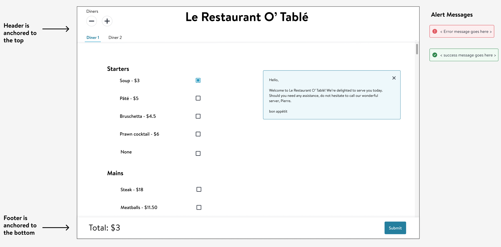

# Instructions

# OpenTable front-end coding challenge

Thank you for accepting our coding challenge. Please take as much time as required to give us a good indication of your coding strengths, as your application will provide many topics of conversation in the next interview stage.

## The task

We would like you to build a web application.

- The application will allow one user to select dishes on behalf of two diners.
- The application will present a menu that will be provided and may later require adjustment by a restaurant.
- The application will enforce some restrictions provided by the restaurant. (see [#rules](#rules))

We've prepared a simple data file which contains an example menu with prices to help get you started. This can be found under
`server/menu-data.json`. Please see the [#Server](#server) section for more details.

Please write as clean and maintainable code as possible, and make sure that it's covered by test cases.

## Technology Requirements

- Please do not use class based react components. Use hooks and other modern features as necessary
- If global state management is needed, Redux is preferred
- Correct use of semantic HTML and accessibility is encouraged
- Feel free to use modern browser APIs
- Please refrain from using 3rd party component and styling libraries
- Use the Fetch API for data transfer between client and server
- Feel free to use scss, styled-components, etc.
- Feel free to install any linting and code style tools
- Use Node version 12.\*

## Rules

_To recap, you will build an interface that allows a user to select dishes for a fixed party of **two diners**._
This restaurant unfortunately has a number of rules about the meals that can be ordered.

- Each person must have at least two courses, one of which must be a main.
- Each diner cannot have more than one of the same course.
- There is only one piece of cheesecake left.
- Pierre the snobby waiter will not let you have prawn cocktail and salmon fillet in the same meal.

## Acceptance criteria

- The total bill amount is displayed when at least one dish has been selected.
- An error message is displayed when I try to select an invalid menu combination.
- Your implementation should resemble this design: 
  - the design is also available under the root of this project: [design.png](design.png)

## Submission

Please submit your program either by sending a zip file or by providing a link to a repository, dropbox, etc to your point of contact at OpenTable.

## Server

Data served via the webpack devServer middleware.

The menu data is served at this endpoint:

- GET `/api/menu`

You shouldn't need to modify any of the dev server code.

## Client

client runs on 3000

## To Run

npm i

npm run build

npm run start

The app should launch on http://localhost:3000 -- sometimes chrome will redirect you to `https` so beware of that. If you're having trouble with chrome
redirecting you, see the section below for how to fix that.

## Troubleshooting

Chrome can be a little annoying about local development.

If chrome is blocking you from running locally due to ssl:

- paste this into the url: `chrome://flags/#allow-insecure-localhost`
- Enable the toggle for this setting

If chrome is redirecting your app to https:

- then go to`chrome://net-internals/#hsts`
- Scroll to the bottom and delete the security policy for `localhost`:
  

# Notes

- State management: I did consider using Redux, but because there was really only one state 'item' needed for the entire app (eg. the current selections per user), Redux felt a bit overkill for that single purpose. Thus, I decided to just use the useReducer hook, which felt right for the lower level of complexity required.
- The instructions say that there is a fixed party of two diners, but buttons that seem to allow for the incrementing and decrementing of diners exist regardless. Based on the design image alone, it is unclear whether they are supposed to be disabled buttons, or if they're just there (they do have a gray border but the text is black). Because there are no instructions regarding this, I decided to display an error message when clicking on them.
- There are no close buttons on the alerts, nor any mention of automatic self-destruction protocols, so I took them as things that would stay on the page until the problem is solved (or in the case of the success message, because you can't un-success yourself, it will just be there until the app is restarted).
- Submit button functionality: Nothing is mentioned about this in the case of no errors, but there is a success alert, so I decided to just show that and disable the submit button. There is definitely a lot more that could be done, like rendering the list of only ordered items, disabling all other controls, etc.--but because there is just nothing mentioned in the exercise itself (and it is not meant to take up too much time), I decided to not go forward with it. (I am also guessing that this would perhaps be a next step during the interview.)
- This has not been made deliberately responsive due to time limitations. That said, due to the way the styles are written, it is automatically responsive up to a certain point.
- There are no instructions/rules on where the icons should come from, so I copied SVGs from the react-icons package. Everything used is credited as a comment inside the svg file.
- There is no error handling for the retrieval of the menu file, again due to the time limit and no instructions saying to implement that, as well as simple low possibility of failure in this local example.
